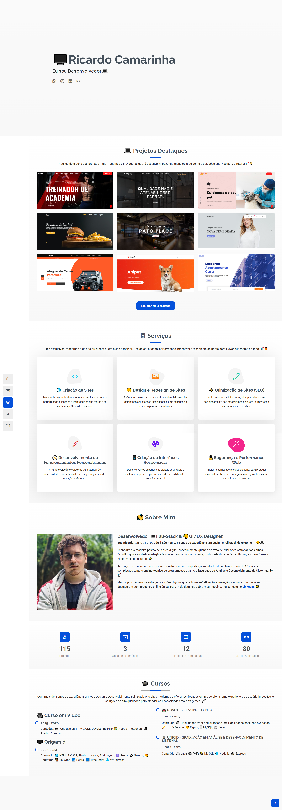

<h2>Sobre o projeto</h2>

<b>Meu Portfólio</b>

## 👉 Visualizar Site: <a href='https://ricardocamarinha.vercel.app/'>Ver Site</a>

### » Tecnologias utilizadas: HTML, CSS, JS, PHP.

##

<h2>Capturas de tela do projeto 📸</h2>
 
<h3 align='center'>Página Inicial 🏡</h3>

  

